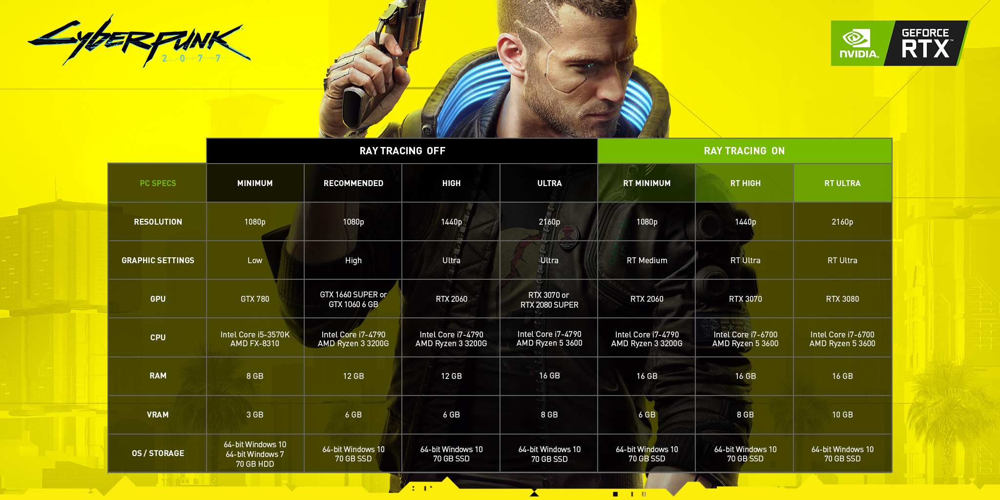

# 硬件介绍

## 显示器

- 2K 60Hz(当前)
- 27寸, 2K,144Hz
  - 目前主流
  - 你不需要144Hz所以不太适合
    - 主要用于射击游戏(CSGO, 守望先锋等)
- 27寸, 4K, 60Hz
  - 我认为目前合适的选择，但是Windows下由于缩放问题27寸的4K与2K显示效果差别不大，所以我认为你以后也没有必要升级这个
- 32寸以上, 4K, 60Hz
  - 你房间有电视了不需要

***所以我认为你最合适的是根据2K 60Hz显示器进行配置***

---

## CPU 

- 3500X
  - 上代AMD, 6核6线程, 可锁全核4.3Ghz
  - [PassMark: 13398](https://www.cpubenchmark.net/cpu.php?cpu=AMD+Ryzen+5+3500X&id=3592)
  - ***已经完全满足你需求***
- 10400
  - 6核12线程, Intel性价比之选
  - [PassMark: 12475](https://www.cpubenchmark.net/cpu.php?cpu=Intel+Core+i5-10400+%40+2.90GHz&id=3737)
- 5600X
  - 最新一代AMD, 6核12线程, 发布会展示了游戏性能，我认为已全面超越同级Intel
  - [PassMark: 22255](https://www.cpubenchmark.net/cpu.php?cpu=AMD+Ryzen+5+5600X&id=3859)
  - ***已经远超你需求***
- 10700K
  - 8核16线程, 老牌i7
    - 搭配**Z系列**主板可CPU超频解锁性能
    - 搭配**Z系列**主板可内存条超频解锁性能
    - 超频需要**更好(贵)**的CPU散热器
  - [PassMark: 19645](https://www.cpubenchmark.net/cpu.php?cpu=Intel+Core+i7-10700K+%40+3.80GHz&id=3733)
  - 如搭配**B系列**主板将***限制其性能***

***满足当前需求我首推3500X, 其次推荐Intel10400***

***CPU有火星撞地球概率用坏, 所以我推荐买散片***

---

## CPU散热器
  - 风冷
    - 最合适省心
  - 水冷
    - 一体式水冷
      - 有小概率漏液风险
    - 分体式水冷
      - 麻烦
      - 贵
      - 有较大概率漏夜风险

***首推4热管风冷***

---

## 主板

- 10400 搭配 B460

  - B系列主板**不支持高频率内存**
  - B系列主板**不支持超频**
    - 华擎部分主板可解锁功耗限制提升性能

- 10700K 搭配 Z490

  - 贵就一个字我只说一次
  - 内存频率可超频至4000Mhz以上, 对内存需求大的应用有加成

- 3500X和5600X 搭配 B550

  - 不限制内存频率

  - 支持PCIE4.0, 面向未来的显卡和存储

    > 目前用处不大

***首推3500X+B550, 其次推荐10400+B460***

---

## GPU

以最新3A CyberPunk2077 为例

- 2K分辨率下RTX2060官方已明确可开高画质
  - 我认为GTX1070Ti强于RTX2060
- RTX3070官方确认4K极致画质
- 光线追踪我认为是4K分辨率显示器才需要考虑的事情

***所以我认为2K 60Hz显示器下, 1070Ti是最佳选择***

***非要买30系列, 我推荐等行情稳定再考虑, 3060Ti已远超2K 60Hz显示器极限***

---

## 内存

- Intel B系列主板2666频率已经是极限
- Intel Z系列主板可选颗粒为三星B die的产品, 可超频至4000Mhz以上
  - ***此项你完全用不上, 属于花钱买开心***

- AMD主板推荐3600Mhz产品, 是***最合适***的频率

***可买普条另配内存马甲, 或者买自带RGB的, 皇家🐔完完全全属于花钱买开心***

***内存条99.99%的厂商都终身质保, 也很少会出故障, 我认为不用买大牌贵的产品***

---

## 固态硬盘

水很深, 尽量买大牌

---

## 电源

水很深, 但有信心保修10年的都不可能会差

---

## 机箱

价格-体积权衡后Matx机箱目前最合适

---

# 推荐表格

|    CPU    | [3500X](https://item.taobao.com/item.htm?spm=a230r.1.14.8.62ab404ekgi53R&id=605447053626&ns=1&abbucket=1#detail) |      [10400](https://item.jd.com/100012587438.html)[^3]      | [5600X](https://detail.tmall.com/item.htm?id=622128960368&spm=a1z0k.7385961.1997985097.d4918997.71b4260bY9cYJn&_u=t2dmg8j26111&skuId=4496934249977) |      |
| :-------: | :----------------------------------------------------------: | :----------------------------------------------------------: | ------------------------------------------------------------ | ---- |
|    GPU    |                          1070Ti[^1]                          |                          1070Ti[^1]                          | 3070                                                         |      |
|   主板    |     [ASUS B550M](https://item.jd.com/100013699280.html)      | [华擎 B460M Pro4](https://detail.tmall.com/item.htm?spm=a230r.1.14.17.1cb36d1bF88F1c&id=619410954667&ns=1&abbucket=1) | [ASUS B550M](https://item.jd.com/100013699280.html)          |      |
| CPU散热器 |        [乔思伯蜂巢](https://item.jd.com/4400825.html)        |        [乔思伯蜂巢](https://item.jd.com/4400825.html)        | [乔思伯蜂巢](https://item.jd.com/4400825.html)               |      |
|  内存条   | [Asgard W2, 8G*2](https://item.jd.com/100004542166.html)[^2] | [KLEVV JJR 8G*2](https://detail.tmall.com/item.htm?spm=a230r.1.14.17.5a404cd7iZMAFD&id=602760548732&ns=1&abbucket=1&sku_properties=1627207:10738663065) | [Asgard W2, 8G*2](https://item.jd.com/100004542166.html)[^2] |      |
| 固态硬盘  |    [东芝RC10 1TB](https://item.jd.com/100012956294.html)     |    [东芝RC10 1TB](https://item.jd.com/100012956294.html)     | [东芝RC10 1TB](https://item.jd.com/100012956294.html)        |      |
|   电源    |         [AG-750M](https://item.jd.com/8670980.html)          |         [AG-750M](https://item.jd.com/8670980.html)          | [Antec HCG750](https://item.jd.com/6828141.html)             |      |
|   机箱    |     [GameMax OMG](https://item.jd.com/100012587438.html)     |     [GameMax OMG](https://item.jd.com/100012587438.html)     | [追风者416PTG](https://item.jd.com/69618937655.html)         |      |
|   总计    |                          ¥5500左右                           |                          ¥5500左右                           | ¥                                                            |      |

[^1]: 可闲鱼购买在保半年以上产品, 1800左右可以买到顶级型号

[^2]: 京东常年打折399, 带RGB灯光

[^3]: 建议购买不带F的型号, 区别在于不带F的有核显

